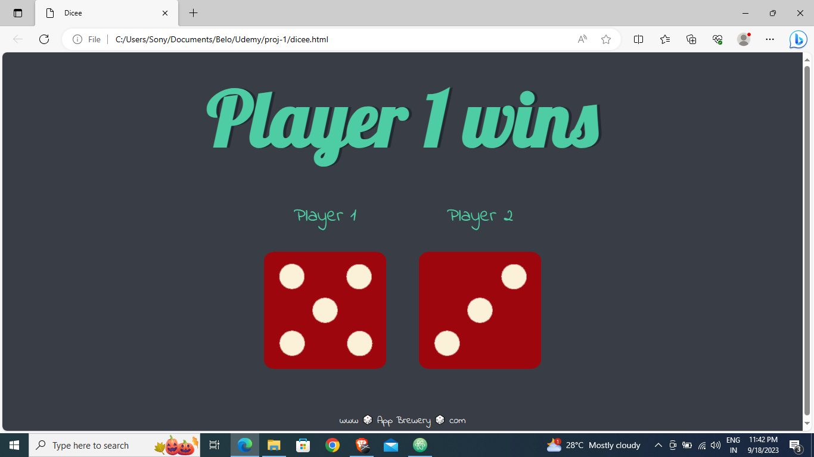

### Projects
A repository of all the small and personal projects created

## Project : Dicee Game

Welcome to the Dicee Game, inspired by Angela Yu's Web Development course - Boss Level Challenge 1.

## Description

This project is a web-based Dicee Game that allows two players to roll virtual dice and determine the winner based on the roll results. It's a simple and fun game that you can play with a friend or by yourself.

## How to Play

1. Open the game in a web browser.
2. Click the "Roll Dice" button to roll the dice for Player 1 and Player 2.
3. The player with the higher dice roll wins the round.
4. The game will announce the winner and update the score.
5. Click "Play Again" to start a new round.

## Preview

## Technologies Used

- HTML
- CSS
- JavaScript

## Credits

- This project was created as part of the "Web Development" course by Angela Yu on Udemy.

## Acknowledgments

- Special thanks to Angela Yu for providing the inspiration for this project through her course.

## License

This project is licensed under the MIT License - see the [LICENSE](LICENSE) file for details.

--- 

## Project 2 :   Suicidal Intention Detection in Text Using BERT-Based Transformers

## Description :
 • Developed a novel approach to identify suicidal intention in text by leveraging BERT-based transformer models.
 
 • Collected and preprocessed a dataset of over 232,000 Reddit posts from the ”SuicideWatch” subreddit, handling
 challenges like broken Unicode and capitalization normalization.
 
 • Implemented and fine-tuned various BERT-based models, including BERT, ALBERT, BERT Experts, BERT with
 Talking-Heads Attention and Gated GELU, and ELECTRA.
 
 • Achieved the highest accuracy of 90.64 and 90.27 on the training and testing sets, respectively, with the BERT with
 Talking-Heads Attention and Gated GELU model

 ## Technologies Used:

 - Python

 - NLP

 - Deep Learning

---

## Project 3 : MILK QUALITY DETECTION USING MACHINE LEARNING ALGORITHMS

## Objective:
 Developed a machine learning model to predict and prevent milk spoilage, reducing financial losses and mitigating health risks.

## Dataset :
 Utilized a dataset from Kaggle with 1059 rows and 8 columns, consisting of seven independent features: pH, temperature, taste, odor, fat content, turbidity, and color. The target variable was the milk grade, classified into low, medium, and high.

 ## ML Techniques :
Implemented multiple machine learning algorithms for milk quality classification, including:
- AdaBoost
- Artificial Neural Networks (ANN)
- Support Vector Machines (SVM)
- Random Forest (RF)
- K-Nearest Neighbors (KNN)
- XGBoost
- Gradient Boosting (GBM)
- Decision Trees (DT)

Data pre-processing involved:
- Label encoding of categorical data.
- Feature scaling using Min-Max scaling and z-score scaling.
- Addressed skewness with PowerTransformer.
- Achieved data normalization through feature-wise scaling to ensure model convergence and prevent feature bias

## Results:

- AdaBoost outperformed other models with a classification accuracy of 99.9%.
- ANN achieved a classification accuracy of 95.4%.
- Random Forest, XGBoost, and KNN also showed high accuracy scores of 98.58%.
- Utilized confusion matrices to visualize and compare results among different algorithms.

## Tools & Technologies Used:

- Languages: Python
- Libraries: scikit-learn, pandas, numpy, matplotlib, seaborn, xgboost
- Platforms: Kaggle
