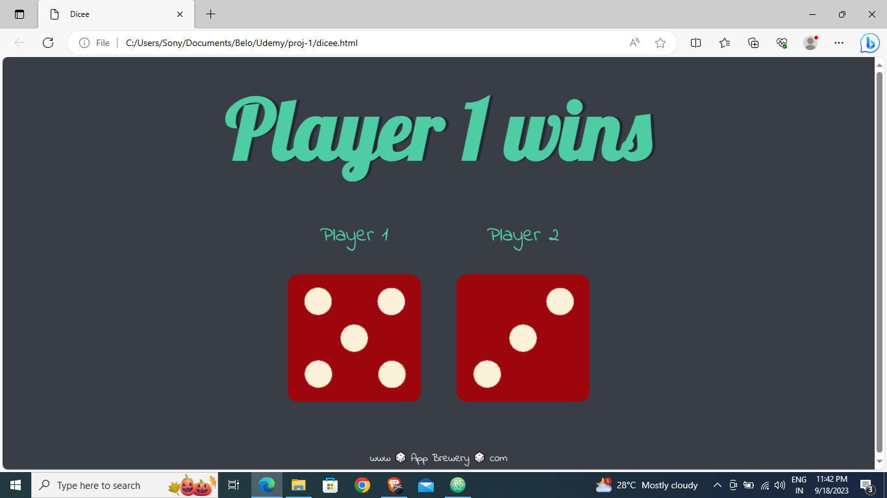

## Project : Dicee Game

Welcome to the Dicee Game, inspired by Angela Yu's Web Development course - Boss Level Challenge 1.

## Description

This project is a web-based Dicee Game that allows two players to roll virtual dice and determine the winner based on the roll results. It's a simple and fun game that you can play with a friend or by yourself.

## How to Play

1. Open the game in a web browser.
2. Click the "Roll Dice" button to roll the dice for Player 1 and Player 2.
3. The player with the higher dice roll wins the round.
4. The game will announce the winner and update the score.
5. Click "Play Again" to start a new round.

## Preview

## Technologies Used

- HTML
- CSS
- JavaScript

## Credits

- This project was created as part of the "Web Development" course by Angela Yu on Udemy.

## Acknowledgments

- Special thanks to Angela Yu for providing the inspiration for this project through her course.

## License

This project is licensed under the MIT License - see the [LICENSE](LICENSE) file for details.

--- 
